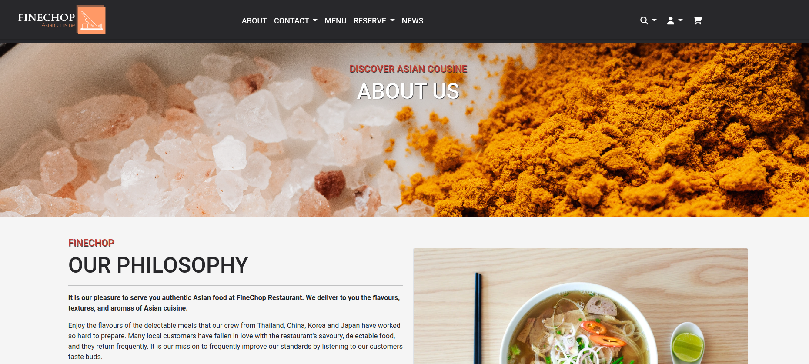
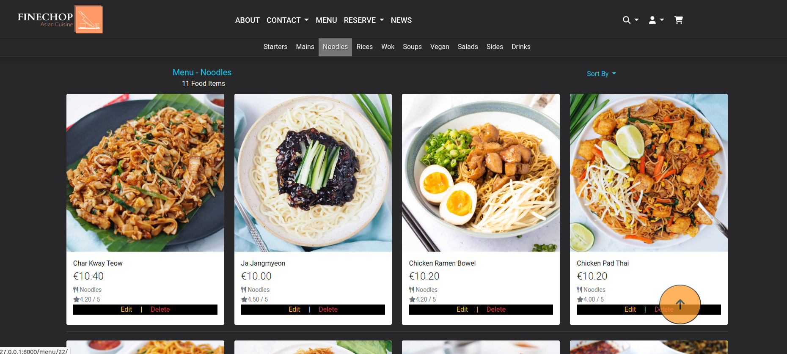
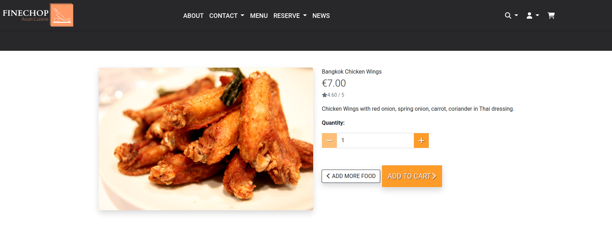
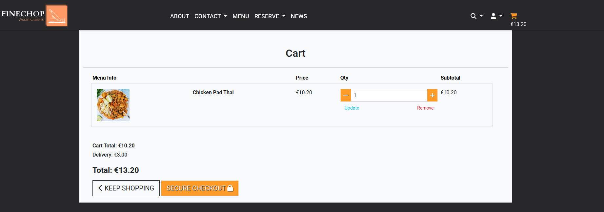
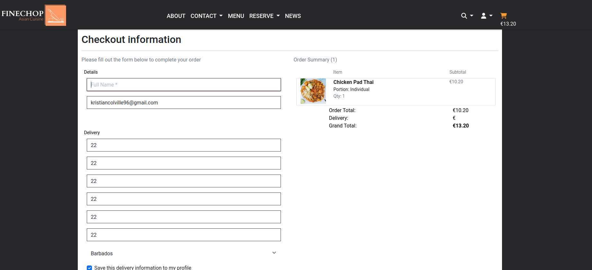
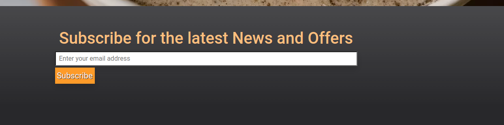
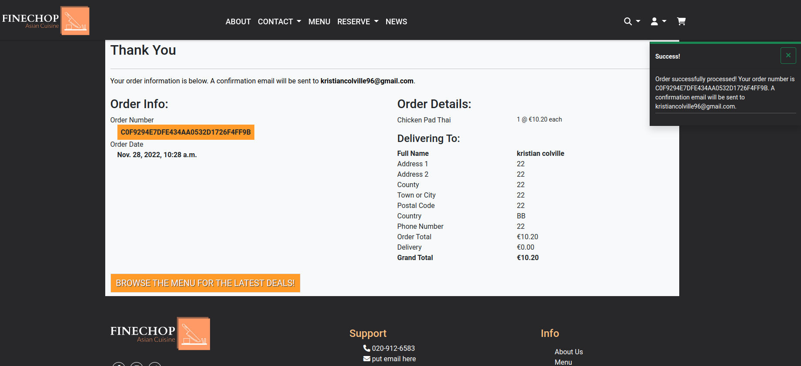
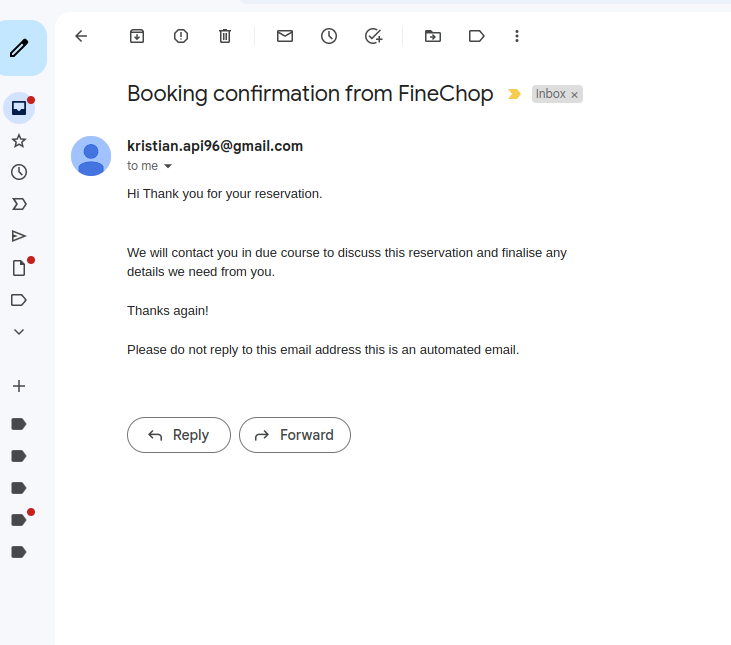

# Feature Documentation

## Table of Contents

* [Features](#features)
* [Return to README](/README.md)

## Features

### Feature Preface

This website has numerous pages to explore. This website has 17 distinctive characteristics. I hope you enjoy reading about the different aspects of this eCommerce website that I created.

### Home Page

As soon as the home page loads we are greeted to an image fade effect that is set to slow so we can see different food items

The effect is created using JQuery and CSS3 to manipulate the DOM Tree. It looks very simple but we have a nice and neat fade effect with no flickering or issues.

The colors demand authority and say here we are come see us.

The page title also shows that this is the home page.

We have a link to the about section to read more about this establishment and we also have a link that brings us straight to the menu page so we can search for food items.

view home page

User Stories fulfilled:

 

### Authentication

Should the user choose to sign in they can easily navigate to the profile icon at the top of the page. This design is intuitive and easy to use.

There are multiple options for signing in. We have 4 social media login options and a regular route to create a profile or access a profile

**Google Login API**

- We now have another fantastic feature with a quick and easy way to sign in using Google

- The Google login service has been made available by the developer to allow quick and simple access to the application

- It eliminates the work and hassle that discourages users from using current web applications

- This tool has been developed to reach 67% of internet users, which is astounding given that this article [here](https://findstack.com/gmail-statistics/#:~:text=As%20of%202020%2C%20Gmail%20is,most%20popular%20personal%20email%20services&text=For%20personal%20email%2C%20Gmail%20and,accounts%20on%20a%20daily%20basis.) details the number of people who have Gmail accounts.

- The benefit in this case, of course, is that by implementing such a system, a sizable chunk of web traffic can access the application more quickly.

Currently the only social media login option working is the Google login API, but thats okay because we have covered over 67% of users for a quick sign in option.

view home page

User Stories fulfilled:

 

### About Section

On this page we have philosophy section detailing FineChops philosophy. There is also a review carousal and another link to the menu page.

view about page

 

### Menu

The food menu consists of various Asian Cuisine food dishes. We have everything from starters to noodle dishes. Loads of options to choose from and the ability to add and remove items from the menu easily.
Food menu's are highlighted with a lighter background when on that url. We can see how many food items there are at the top of the page. There is also search functionality implemented here.
Low to high, or high to low, you can sort by price, rating and name.

On the food items themselves you can see the name, rating and price to help guide you through your customer experience.

view food menu

 

### Menu Item Detail

When you click on a menu item image it will take you to the menu item detail page for that particular item. The layout is excellent you can identify the price easily and read a description of the food item if your not sure what it's made from. The option is also there under the hood to attach allergen notices to the food items. I left them alone and will definitely add them in a later edition of this website.

view menu item details

 

### Cart

Heading over to the cart after adding a menu item is straight forward. You can see a big orange button waiting to clicked. When you arrive at the cart you can update or remove items from your cart.
Once a menu item is added to the cart a price is immediately evident under the cart icon in the rop right corner. This helps you to calculate your cart total and budget for your purchase.

view cart

 

### Checkout

Satisfied with our items in the cart we can move onto the checkout page and begin the process of ordering a delivery from FineChop. Stripe has been implemented so we can test this functionality. Use this credit card number 4242 4242 4242 4242. The other options on the card don't matter as it's for testing and simulating a purchase. 

view checkout

 

### Subscriptions - Newsletter

Back on the home page we can see the newsletter that users can subscribe to if they have an account with us. The subscription functionality has been implemented only partially and there remains some small touches that when added could help lift this feature massively. For example, an admin user can create content for news letters for sending users and with some love it could easily be extended to post these articles to the news portion of the website.

view subscriptions

 

### Messages

When a user adds or removes items from their cart they will see what are called *toasts* displayed in the top right of the screen on larger devices and center top on smaller devices. These messages fade away only after a few seconds but they are informative and supply users with constant feedback for the actions they are trying to perform on the website. Users will find this helpful and feel guided to their destinations.

They are insightful and don't keep the user guessing.

view messages

 

### Orders

When a user purchases food items successfully they will receive an order confirmation. This will bring them to the page called Checkout Success. They can see all their details. I have wrapped the order number in an orange background for added authenticity. It looks like a modern confirmation page and has excellent UI/UX components. We can see our order details and the address it was sent to.

view order confirmation

 

### Bookings

We can book tables at FineChop and get notified if the table is available. This functionality provides the user with the ability to dine-in if they choose.

view booking

 

### Email Confirmations

And always, the most important thing, email confirmations. Users will get notified to the email address they provided in the forms for either purchases or bookings.
This helps keep users informed by providing with them a record of a booking/order.

view email confirmation

 

[Back to Top](#table-of-contents)