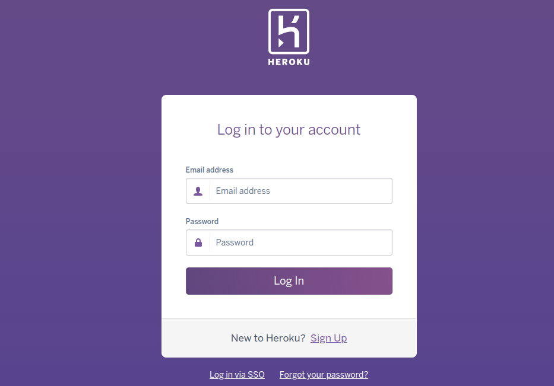
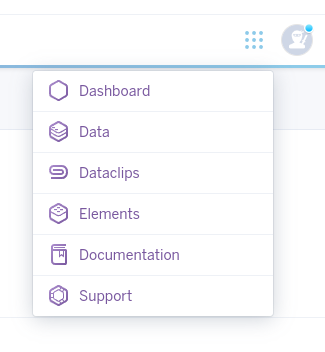
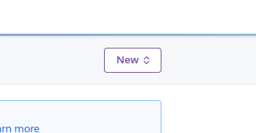
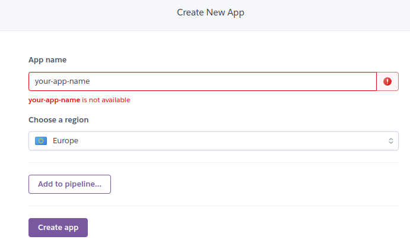
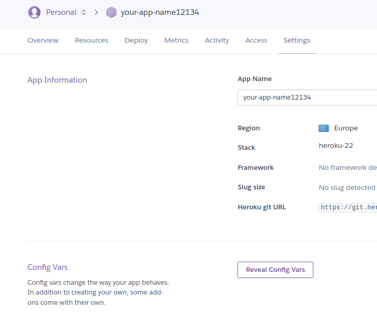
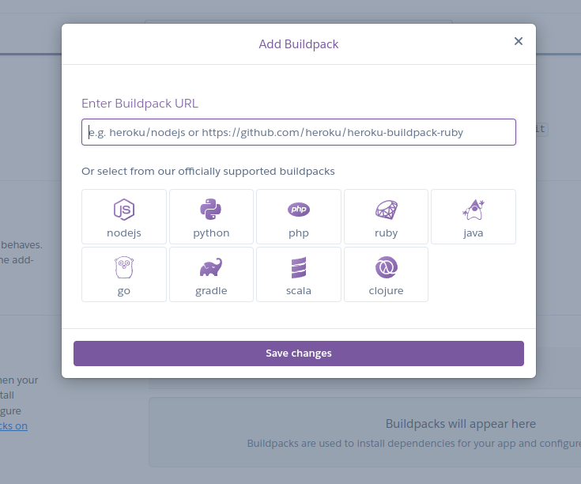
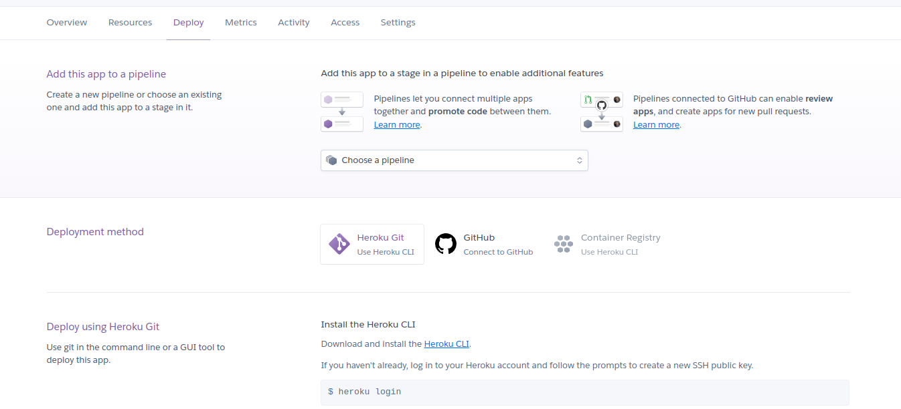

# Fine Chop

Developer: Kristian Colville

[Visit this website]()

 

## Table of Contents

* [Project Goals](#project-goals)
    * [User Goals](#user-goals)
    * [Site Owners Goals](#site-owners-goals)
* [User Experience](#user-experience)
    * [Target Audience](#target-audience)
    * [User Requirements and Expectations](#user-requirements-and-expectations)
    * [User Stories](#user-stories)
* [Design](#design)
    * [Color Scheme](#color-scheme)
    * [Typography](#typography)
    * [Structure](#structure)
        * [Wireframes](#wireframes)
* [Business Model](#business-model)
    * [Goals](#goals)
    * [Target Audience](#target-audience)
    * [Strategy](#strategy)
* [Web Marketing](#web-marketing)
* [Agile Methodology](#agile-methodology)
* [Information Architecture](#information-architecture)
    * [Database](#database)
    * [Data Modeling](#data-modeling)
* [Features](#features)
* [Testing](#testing)
* [Bugs](#bugs)
* [Technologies & Tools](#technologies--tools)
* [Development & Deployment](#development--deployment)
    * [Version Control](#version-control)
    * [Cloning this Repository](#cloning-this-repository)
    * [Heroku](#heroku)
    * [Stripe](#stripe)
* [Credits](#credits)
* [Acknowledgments](#acknowledgments)

## Project Goals

The project's main goal was to develop an Asian-style restaurant/takeaway eCommerce website that takes advantage of UI/UX design concepts, offers users services to meet their demands, is fully operational, and has a distinct business model.

Another goal for the project was to show a love for Asian cuisine and develop a website that gives a big shout-out to businesses that cater in Ireland.

### User Goals

* Quick login options
* Create an account on FineChop and personalize a profile
* Add meals to a basket for purchase
* Order food for delivery or for dining in
* Quickly order a meal and have multiple options
* Keep up to date with offers and deals
* Have the ability to provide feedback or reviews
* Ability to repeat orders
* Buy vouchers or gifts
* Book tables and seating for groups

### Site Owners Goals

* Create an Asian-style eCommerce restaurant website that has the look and presentation of an experienced brand
* Allow users to use CRUD functionality where ever possible to keep people engaged in a meaningful and interactive way
* Provide users with the ability to purchase meals for delivery or for in house dining
* Provide clear navigation for users to easily follow and get to their final destination
* Build a responsive and accessible website for a wide audience
* Build the website with the Asian culture in mind that shows admiration and respect
* Effectively use digital marketing for email & social media
* Show users a clear well defined business and keep simplicity wherever possible
* Provide staff of the restaurant methods of improved productivity for the eCommerce web app
* Build a website that provides ways of improved data analytics to help with the business goals

[Back to Top](#table-of-contents)

## User Experience
### Target Audience

* Any user that is interested in Asian cuisine
* Users who would like to order a delivery meal
* Users interested in booking tables for a dine in experience
* Users familiar with the Asian culture and the types of services offered in the restaurant industry
* People who enjoy the services provided by an experienced brand
* Users that would like to share their experiences and leave feedback/reviews
* Users with an interest in purchasing delicious food

### User Requirements and Expectations

* Simplicity throughout the website for clear navigation with the goal of completing an order
* Information is structured in an organized and easy-to-follow manner
* The CRUD functionality works as expected with feedback provided for each appropriate response
* The simplicity is perfectly implemented with no unnecessary complexity diminishing the user experience
* The design should look authentic & respectful with a care to avoid making an artificial imitation of an Asian-style restaurant
* The website needs to address a wide audience and so should provide ease of accessibility for visually impaired users
* This eCommerce site needs to be built with a mobile first design and a good level of responsive design
* The content should be minimal and avoid long keyword phrases for mobile users
* The website should take multiple user interactions into account
* Bring engagement from digital marketing and provide systems and accounts to build the brand
* Show users a consistent design across all channels of engagement
* Calls to action should be built and implemented with care
* Any and all personal information is securely stored and protected
* The website should be built with genuine love for the food and not bring about a plastic experience
* Provide multiple options for engagement and successfully implement methods strategies for the business model
* The business model and intentions of the website are clear to the user
* When building for eCommerce a huge amount of UI/UX design has been thoughtfully implemented for common practices
* The user can predict actions and outcomes successfully because of the UI/UX design
* Avoid distracting colors and patterns, decorate with simplicity and provide appealing imagery
* As eCommerce relies heavily on users purchasing products and services it is important that the SEO is perfectly implemented
* Effectively build with user roles in mind and abstract issues for designing the website

### User Stories

User roles:

    New User, Returning User, Customer,
     Executive Chef, Receptionist, Delivery Driver,
      Site Owner, Developer

#### New User

| Issue ID | User Story |
|---|---|
|||
|||
|||
|||

 

#### Returning User

| Issue ID | User Story |
|---|---|
|||
|||
|||
|||

 

#### Customer

| Issue ID | User Story |
|---|---|
|||
|||
|||
|||

 

#### Executive Chef

| Issue ID | User Story |
|---|---|
|||
|||
|||
|||

 

#### Receptionist

| Issue ID | User Story |
|---|---|
|||
|||
|||
|||

 

#### Delivery Driver

| Issue ID | User Story |
|---|---|
|||
|||
|||
|||

 

#### Site Owner

| Issue ID | User Story |
|---|---|
|||
|||
|||
|||

 

#### Developer

| Issue ID | User Story |
|---|---|
|||
|||
|||
|||

[Back to Top](#table-of-contents)

## Design
### Color Scheme
### Typography
### Structure
#### Wireframes

[Back to Top](#table-of-contents)

## Business Model

The business model for FineChop is B2C, the target audience for selling products and services is for customers only. The sole focus is on individual transactions and catering for the individual. The business model aims at providing individuals with an excellent option for a takeaway/dine-in experience.

### Goals

- Provide excellent customer satisfaction
- Provide a UI/UX design for the website that helps customers perform actions
- Create a lively atmosphere for people and show excellent all round service
- Bring flavour to life and showcase delicious meals
- Bring the website to life and make it as inviting as possible
- Provide staff with improved productivity methods to increase sales and performance
- Improve wait times
- Market the business effectively across all channels

### Target Audience

The **FineChop** web app is aimed at targeting a wide audience and being well rounded for all demographics to achieve their goals. Everyone has a favorite go to meal they might get in an Asian-style restaurant. The restaurant aims at providing everyone with the best possible service. The age criteria that we aim to provide services to would be at least 18 and older. Customers of **FineChop** need a good user experience so providing them with the ability to find products and services they are looking for is essential. **FineChop** aim to offer the best service available in the food industry and strive to make wait times low & food perfect whether thats in house or takeaway. 

### Strategy Trade-Off

The restaurant business is highly competitive and the strategy trade-off for **FineChop** is to design and build an application capable of improving performance so it needs to be as user friendly as possible.

* Consistent design
* Simple navigation
* Intuitive interface
* Ease of accessibility
* Full access for ordering without account
* Quick and simple purchase
* Optimized for mobile users
* Simple pricing system
* Excellent SEO
* Improved productivity for essential staff members

[Back to Top](#table-of-contents)

## Web Marketing

[Back to Top](#table-of-contents)

## Agile Methodology

[Back to Top](#table-of-contents)

## Information Architecture
### Database
### Data Modeling

[Back to Top](#table-of-contents)

## Features

All the features documentation can be found [here](/FEATURES.md)

[Back to Top](#table-of-contents)

## Testing
All the Testing documentation can be found [here](/TESTING.md)

[Back to Top](#table-of-contents)

## Bugs

| Issue ID | Expected Behaviour | Behaviour reported | Bug Fix |
|---|---|---|---|
|[#8](https://github.com/KristianColville1/fine-chop/issues/8)|When the dropdown menu is clicked it slides a menu downwards to display the menu for the user|Dropdown menu slides up and down but the page also scrolls up to the top. Bad user experience| Added preventDefault to jquery event for sliding dropdown menu's and reevaluated using a general purpose event, fixed issue and created general purpose click event for dropdown menu's|
|||||
|||||
|||||

[Back to Top](#table-of-contents)

## Technologies & Tools

[Back to Top](#table-of-contents)
## Development & Deployment
### Version Control

I used [Visual Studio Code](https://code.visualstudio.com/) as a local repository and IDE & [GitHub](https://github.com/) as a remote repository.

1. Firstly, I needed to create a new repository on Github [fine-chop](https://github.com/KristianColville1/fine-chop).
2. I opened that repository on my local machine by copying the URL from that repository and cloning it from my IDE for use.
3. Visual Studio Code opened a new workspace for me.
4. I created files and folders to use.
5. To push my newly created files to GitHub I used the terminal by pressing Ctrl + shift + `.
6. A new terminal opened and then I used the below steps.

    - git add (name of the file) *This selects the file for the commit*
    - git commit -m "Commit message: (i.e. Initial commit)" *Allows the developer to assign a specific concise statement to the commit*
    - git push *The final command sends the code to GitHub*

### Cloning this Repository

If you would like to clone this repository please follow the bellow steps.

Instructions:

1. Log into GitHub
2. Navigate to the repository you want to clone
3. Click on the green button labelled 'Code'
4. Copy the URL under the HTTPS option
5. Open an IDE of your choosing that has Git installed
6. Open a new terminal window in your IDE
7. Type this exactly: git clone the-URL-you-copied-from-GitHub
8. Hit Enter

You should have a local copy of the repository to use on your machine.

If you encounter problems after cloning this project please make sure you have also installed the requirements to run this project

- Create a virtual environment by running the command in the terminal:
    - **python3 -m venv .venv**

- Activate your virtual environment by running the command:
    - **source .venv/bin/activate**

- Run the command to install these requirements:
    - **pip3 install -r requirements.txt**

Please see this [page](https://git-scm.com/book/en/v2/Git-Basics-Getting-a-Git-Repository) for a comprehensive walk-through and explanation of how to use Git and GitHub if you are unsure how to do so or if you encounter any more problems.

### Heroku

I selected [Heroku](https://dashboard.heroku.com) as a deployment option. As of the time of writing, it provides customers with a free tier, allowing them to quickly publish apps if they are just starting as developers

To deploy a project using Heroku follow these steps:

- Log into heroku

- Go to the heroku dashboard

- Create a new app by selecting 'New'

- Give your application a name and select a preferred location
    - The EU region was chosen for this application as the developer is located in this region

- Click the 'Create app' button

- If you have config variables in your application
    - Click on settings
    - Click 'Reveal config vars'
    - Input your deployment variables

- If you need specific build packs
    - Click on settings
    - Click on build pack
    - Add your packs as needed (Please be aware that the order matters)
    - No specific build packs were selected for this project as Django used.

- Once these steps are completed
    - Go to the deploy section
    - Select your version control system
    - For Daily Sync, GitHub was selected

- Connect your version control system
- Add your repository
- Connect the app selecting 'connect'
- Either choose automatic deployment or manual deployment
- Once all these steps are completed and the build is successful
    - You can click the 'view' button
    - It will reveal your deployed app
    
### Stripe

[Back to Top](#table-of-contents)

## Credits
## Acknowledgments

[Back to Top](#table-of-contents)
