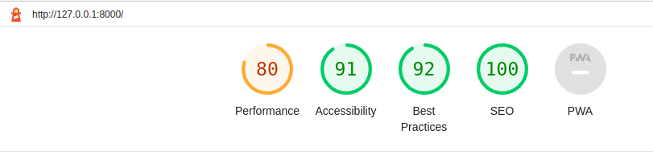
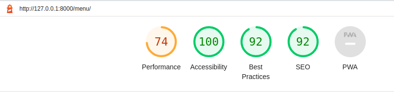
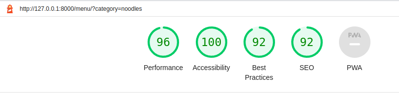
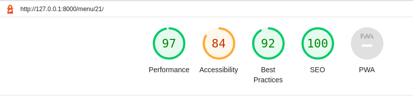
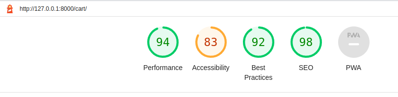
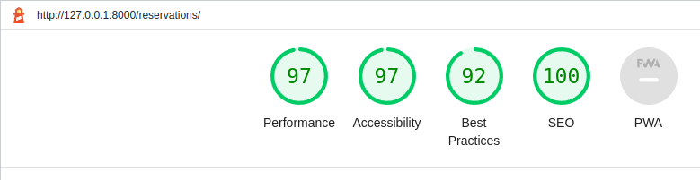
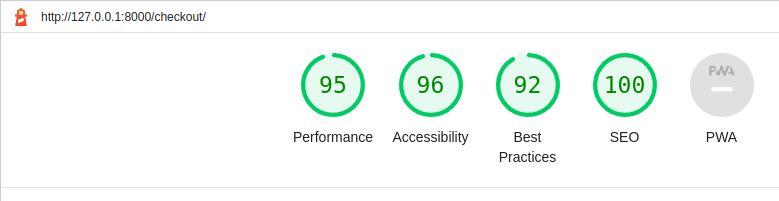
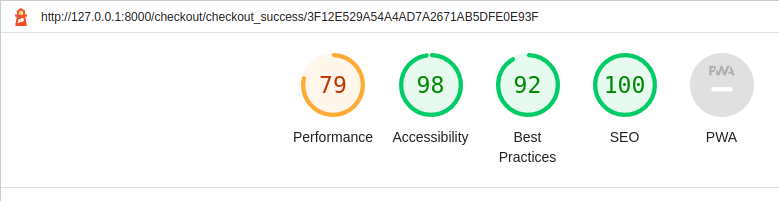
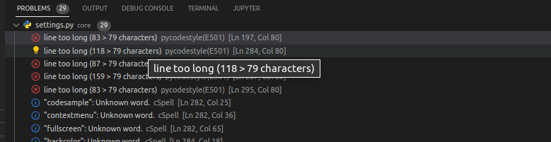

# Testing Documentation

## Table of Contents

* [Testing](#testing)
* [Validation](#validation)
* [Return to README](/README.md)

# Testing

## Manual Testing

As a means of testing functionality manual testing was carried out on the web application.

### Testing Usability

Using the method of acceptance testing by using multiple users to test different portions of the website.

| Testing | Actions | Expected results | Completed | Comments |
|---|---|---|---|---|
|Home Page|---|---|---|---|
|---| Load page | The page should load without errors |y|---|
|---|Icons visible|Clearly indicate icons|y|---|
|---|FeedBack provided| loads |y|---|
|---|Images fade and repeat with no flicker| Images are repeating correctly |y|---|
|Google Login |---|---|---|---|
|---| Load page | The page should load without errors |y|Client ID and Key added successfully|
|---|Click on sign up button|Redirected to sign in|y|---|
|---|Verification notice |Email delivered|y|---|
|---|Buttons|Clicking produces result|y|---|
|---|FeedBack provided| loads correctly |y|---|
|Sign Up|---|---|---|---|
|---|Click on sign up button|Redirected to sign up|y|---|
|---|Entering Details|Inputs fields should work |y|---|
|---|Verification notice |Email delivered|y|---|
|---|Buttons|Clicking produces result|y|---|
|---|FeedBack provided| loads |y|---|
|Sign In|---|---|---|---|
|---|Click on sign up button|Redirected to sign in|y|---|
|---|Entering Details|Inputs fields should work |y|---|
|---|Forgotten Password |Verification Code delivered|y|---|
|---|Buttons, Links|Clicking produces action|y|---|
|---|FeedBack provided| loads |y|---|
|Nav|---|---|---|---|
|---|Dropdown|Dropdown menu slides menu down and up |y|---|
|---|Buttons, Links|Clicking produces action|y|---|
|---|Icons visible|Clearly indicate icons|y|---|
|---|---|---|---|---|
|Mobile Nav Bottom |---|---|---|---|
|---|Search|Should pop up and down when clicked |y|---|
|---|Buttons, Links|Clicking produces action|y|---|
|---|Icons visible|Clearly indicate icons|y|---|
|---|---|---|---|---|
|Menu Item|---|---|---|---|
|---|Entering Details|Inputs fields should work |y|---|
|---|Buttons, Links|Clicking produces action|y|---|
|---|FeedBack provided| loads |y|---|
|Menu Detail|---|---|---|---|
|---|Entering Details|Inputs fields should work |y|---|
|---|Buttons, Links|Clicking produces action|y|---|
|---|FeedBack provided| loads |y|---|
|Checkout|---|---|---|---|
|---|Entering Details|Inputs fields should work |y|---|
|---|Buttons, Links|Clicking produces action|y|---|
|---|FeedBack provided| loads |y|---|
|Checkout Success|---|---|---|---|
|---|Buttons, Links|Clicking produces action|y|---|
|---|FeedBack provided| loads |y|---|
|Order Confirmation|---|---|---|---|
|---|Emails Sent for Confirmation| Clicking produces action |y|---|
|---|FeedBack provided| loads |y|---|
|Profile|---|---|---|---|
|---| Load page | The page should load without errors |y|---|
|---|Entering Details|Inputs fields should work |y|---|
|---|Buttons, Links|Clicking produces action|y|---|
|---|Icons visible|Clearly indicate icons|y|---|
|Messages|---|---|---|---|
|---| Alerts | All open when activated |y|---|
|---|Success|message pops up providing feedback |y|---|
|---|Warning |message pops up providing feedback |y|---|
|---|Info|message pops up providing feedback |y|---|
|---|Error|message pops up providing feedback |y|---|
|Contact|---|---|---|---|
|---| Alerts | Users are provided with feedback after interactions |y|---|
|---|Sending contact form| forms open and are handled correctly |y|---|
|---|Links opening and Post methods | handles correctly and submits properly |y|---|
|---|Career form submits | file is uploaded to S3 and accessible from admin view for staff users |y|---|
|Search|---|---|---|---|
|---| Load page | The page should load without errors |y|---|
|---|Entering Details|Inputs fields should work |y|---|
|---|Buttons, Links|Clicking produces action|y|---|
|---|Icons visible|Clearly indicate icons|y|Intuitive|
|Search Mini |---|---|---|---|
|---| Load page | The page should load without errors |y|---|
|---|Entering Details|Inputs fields should work |y|---|
|---|Buttons, Links|Clicking produces action|y|---|
|---|Icons visible|Clearly indicate icons|y| Intuitive |
|Footer|---|---|---|---|
|---| Link Names | The page should load without errors and all links have discernible names or imply meaning |y|Intuitive|
|---|Links Opening|All external links open as expected in new tab and internal links open within the same tab |y|---|
|---|Icons visible|Clearly indicate icons|y| Intuitive |

 

# Validation

Django HTML is throughout the website

HTML: validated using WC3 Validator CSS: validated using Jigsaw W3 Validator

No errors validating html or css

### Python

No errors detected. I have pycodestyle installed in my workspace on VSCode and the only errors I'm recieving are for the settings.py file for line too long.

### Responsiveness

Devices tested were used with Chrome Developer Tools. Generous amount of responsiveness for devices of all sizes.

        Moto G4
        IPhone SE
        IPhone XR
        IPhone 12 Pro
        Pixal 5
        Samsung Galaxy S8+
        Samsung Galaxy s20 Ultra
        IPad Air
        IPad Mini
        Surface Pro 7
        Surface Duo
        Galaxy Fold
        Samsung Galaxy A51/71
        Nest Hub
        Nest Hub Max
        Asus monitor (developers monitor)
        AOC monitor (developers monitor)

[Back to Top](#table-of-contents)